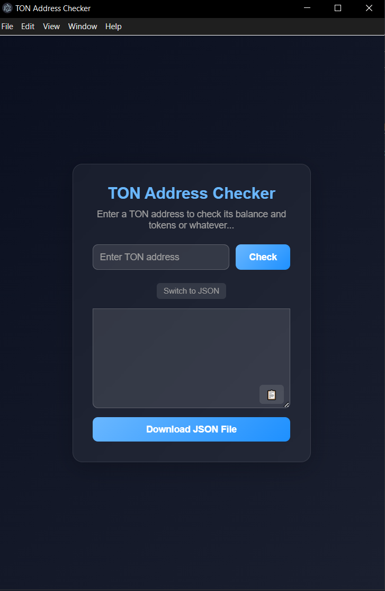
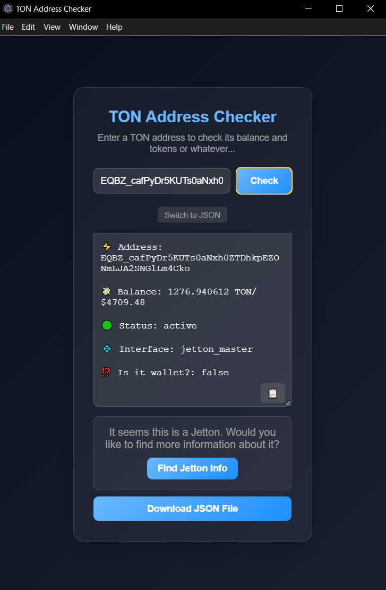
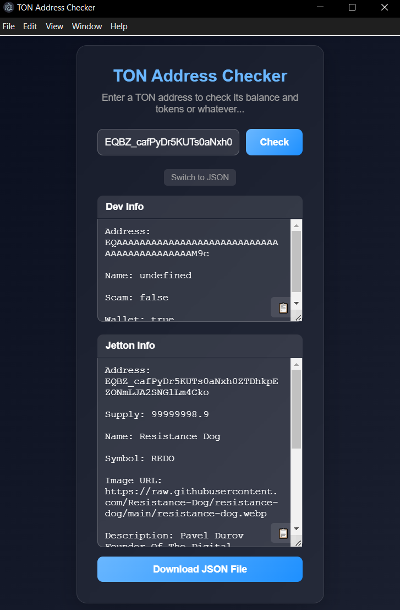

# jetton_analyser
Jetton/TON wallet analyser

## To use software:
Use this command to clone my repository: <code>git clone https://github.com/stopbe1nglame/jetton_analyser.git</code>

Then, you open this directory in your IDE(Let's say visual studio) and use terminal to run command: <code> npm run start </code>

## How to use?

When you already launched it using <code> npm run start </code> you will see this menu:

In "Enter TON address" enter any address on TON network, it will show you information for it.

However, if you put in Jetton address, you will see this:

Click "Find Jetton Info" if you need detailed information on Jetton Dev and Jetton itself.

## Other
Using this software you can get information in User-Friendly/JSON format, it's up to you.

You can either download the information in JSON file to continue your work on it, which makes requests to ton api easier or copy it to clipboard.

## Examples

### Wallet Information Example:
⚡️ Address: EQCmMfkHNuTw-9Notz64kDYEUQ-pLaGw0CtFLBP-JDwhGFx5

💸 Balance: 32.153191074 TON/ $118.74

🟢 Status: active

💠 Interface: wallet_v5r1

⁉️ Is it wallet?: true

### Dev Information Example:
Address: EQAAAAAAAAAAAAAAAAAAAAAAAAAAAAAAAAAAAAAAAAAAAM9c

Name: Pavel Durov

Scam: false

Wallet: true

### Jetton Information Example: 
Address: EQBZ_cafPyDr5KUTs0aNxh0ZTDhkpEZONmLJA2SNGlLm4Cko

Supply: 99999998.9

Name: Resistance Dog

Symbol: REDO

Image URL: https://raw.githubusercontent.com/Resistance-Dog/resistance-dog/main/resistance-dog.webp

Description: Pavel Durov Founder Of The Digital Resitance Dog - $REDO is a meme coin on the TON Blockchain. https://t.me/RedoTON

Website: https://www.redoton.com/

Socials: https://t.me/redoton, https://twitter.com/redoonton

Holders: 25851

Verification: whitelist